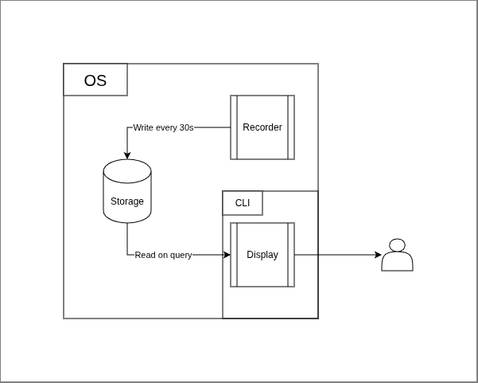

# **Glasses**: Design Document

- **Author**: Yashas
- **Date**: 16th Aug 2026 - 17th Aug 2026
- **Status**: Draft
- **Reviewer**: Shrihari
- **PRD**: [PRD.md](PRD.md)

##  Context

Read the [PRD.md](./PRD.md) file, it will tell you want we are building. In summary we are building a tool for understanding system resource usage by applications/process.

## Technical goals & non-goals

| **Goals** | **Description**                                              |
| --------- | ------------------------------------------------------------ |
| G1        | The recorder will be a background system process which will consume less than 1% of CPU and consume less than 50MBs of memory |
| G2        | 30 day data must be less than 150mb on the disk              |
| G3        | Data older than 30days gets removed automatically            |
| G4        | All display of data or query must happen under 2 seconds from the call |
| G5        | If the recorder crashes, previously recorded data stays readable and at most one sample is lost |
| G6        | In 24 hour time span, no more than 1% of samples can be lost |
| G7        | Read from display must not block writes on the storage       |
| G8        | A sample will only be read when its complete                 |
| G9        | A corrupt sample will have "-"s                              |
| G10       | When there are no samples the display will have no values i,e the display is empty |
| G11       | Once enabled, recording resumes automatically on every subsequent system boot without further user action, until explicitly disabled |
| G12       | After enabling, recording of first sample happens after 30s  |
| G13       | Once disabled, recording does not start on reboot            |
| G14       | A gap where the system was off is shown as an explicit marker line, not as individual timestamped rows for that period |
| G15       | If data is unreadable/corrupt/missing there will be timestamps. If system was off then timestamps will not be available |
| G16       | Tool will be compatible with Windows 11 and 10               |
| G17       | Output must fit within an 80-column terminal width, with no line wrapping or truncation |
| G18       | Data stored on the disk is persistent across reboots         |
| G19       | The tool detects and flags manual system clock changes, so a clock jump is never mistaken for elapsed real time |
| G20       | There will be only one recording instance on one machine. If a second instance is started it will not start and user will see a message saying recorder is running |
| G21       | The recorder is system level not user level. i.e if another user logs into windows and the recorder was previously enabled recorder will be collecting data |
| G22       | If there are multiple disks they will all be kept track of as long as they are inside the device. |
| G23       | If the battery is not connected here will be no data in that cell |
| G24       | If the battery has no power but its connected it will show up as 0% |
| G25       | When the tool is uninstalled all the data related to it will be removed off the system |
| G26       | Network IO will track of all and each physical input output channels |

| **Non-Goals** | Description                                                  |
| ------------- | ------------------------------------------------------------ |
| NG1           | Tool not compatible with Linux, MacOS, Open/FreeBSD          |
| NG2           | Tool will not inform why corrupt data is bad                 |
| NG3           | Tool will not work when memory is at 100%                    |
| NG4           | Tool will not record when disk is at 100%                    |
| NG5           | For v1, sampling interval and data retention period are constant |
| NG6           | If a clock change occurs past timestamps are not updated     |
| NG7           | The storage of collected data will occur on a single disk    |
| NG8           | Externally connected disks (USB, external HDD/SSD) are not tracked. |
| NG9           | Non-physical network IO will not be tracked                  |

## Overview

There are three parts-Recorder, Storage and Display

### The Recorder

It is a background system level process which will record system resource data every 30s and consumes less than 50MB and less than 1% of CPU

### The Storage

It is the SQLite database which stores system resources data. It is written by The Recorder and is read by The Display. 

### The Display

This is CLI tool which will show the user the data regarding system resources

## Detailed Design

### Components

As mentioned above this tool has three parts. Recorder, Storage, Display.

#### The Recorder

| **Decision** | **Description** |
| --- | --- |
| D1 | The Recorder will be a scheduled task under Windows Task Scheduler named GlassesRecorder. The task is registered once, at install time (`glasses start`), via `schtasks /Create`. The task's trigger is ONSTART, running under the SYSTEM account, this is what actually launches the recorder on every subsequent boot. The GlassesRecorder is a system process running while the system is ON. |
| D2 | The recorder will be written in python3 and compiled to bin(exe application) via Nuitka. |
| D3 | Recorder will record the system data such as CPU info with %, memory, disks, NetworkIO and battery and top 10 process using python modules like `psutil` and `wmi`. The recorder will also use `logging`, `sqlite3`, and `datetime` for datetime(both monotonic and UTC timestamps). |
| D4 | The logging module is used for logging for debugging. The logging is written to a .log file in C:\ProgramData\Glasses\logs\glasses_recorder.log. The logs older than 7 days gets deleted. The logs will use the 150MB budget assigned to storage. |
| D5 | From the start the recorder will keep storing both UTC, machine's local time and relative(monotonic) timestamps. |
| D6 | On launch, recorder will create the mutex. If GetLastError() is not ERROR_ALREADY_EXISTS, it holds the mutex and proceeds. If GetLastError() is ERROR_ALREADY_EXISTS then another instance is running, recorder will log it and exit. The recorder will have prefix of Global\ making a system wide namespace. |
| D7 | The recorder will use psutil's cpu_percent with interval=None. When the recorder starts it will call cpu_percent once and its value gets thrown away. For that first (priming) sample, the process's CPU% is stored as -, not the raw value psutil returns, since it isn't a real reading yet. |
| D8 | The sleep_time+record_time=30s, record_time is time need for recording a sample and sleep_time is time recorder was sleeping |
| D9 | The recorder will only write samples to storage |
| D10 | If recorder is unable to get a value it will log the error and put "-" in place of the value |
| D11 | If recorder is unable to write a sample it gets logged and the recorder continues work as usual |
| D12 | The recorder will have No battery if there is no battery attached and 0% if the battery is empty as it uses psutil.sensors_battery() |
| D13 | The recorder will use psutil.disk_partitions(all=False) to get disk info |
| D14 | The recorder identifies physical network adapters via WMI's Win32_NetworkAdapter.PhysicalAdapter boolean, enumerated once at startup (not re-queried each sample) and matched to psutil.net_io_counters(pernic=True)'s per-NIC keys using NetConnectionID. Rejected relying on psutil alone, since it has no built-in physical/virtual distinction for network interfaces. Known limitation, accepted: PhysicalAdapter occasionally misclassifies adapters created by VPN clients or virtual switches. |
| D15 | The first sample data recording occurs after 30s of recorder being enabled |

### The Storage

| Decision | Description                                                  |
| -------- | ------------------------------------------------------------ |
| D16      | The Storage will be SQLite                                   |
| D17      | It will store the data recorded by recorder. Display will query this DB for data. |
| D18      | SQLite's SQL queries (time-range, aggregates) serve R9/R11 without loading whole files into memory, keeping reads within G4's 2s budget as data grows. |
| D19      | Rejected Postgres/MySQL: needs a running server process, conflicting with G1's CPU/memory budget and the local-only non-goal. |
| D20      | Rejected flat files (CSV/log lines): no indexed queries, no write atomicity for G8, poor fit for variable-length multi-disk/NIC data. |

### The Database

- The database is RDBMS
- The tables are-> sample(id, cpu_%, battery%), memory(sample_id, free, total), disk(sample_id, partition, disk_size, used_disk), network_interface(id INTEGER PK, connection_id TEXT UNIQUE), network_io(sample_id FK, interface_id FK, bytes_sent, bytes_recv, PRIMARY KEY(sample_id, interface_id)), timestamps(sample_id, utc_timestamp, machine_timestamp, monotonic_timestamp), process(sample_id, rank, resource_top_type, process_id, process_name, cpu_%, memory_used%)
